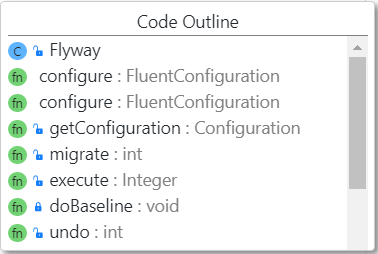
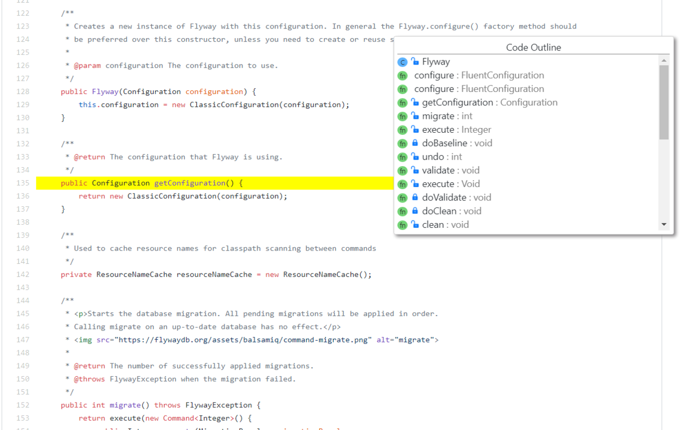

# GithubCodeOutline
A chrome extension to show outline for a code file on github

Currently only supports Java, Javascript and Typescript files.
Uses regex for pattern matching.

https://chrome.google.com/webstore/detail/github-code-outline/cbmbcfbceckimjbpojfcganogblfocjf?hl=en&authuser=0
